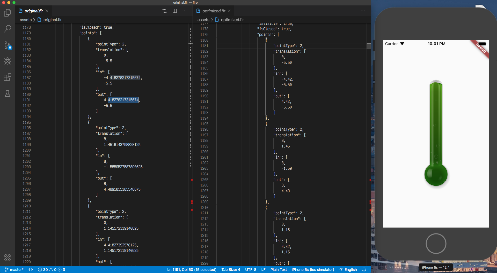

:globe_with_meridians:  [english](README.md)    |   [český](README.cz.md)    |   **<u>русский</u>**

# FLRO

FLR Optimizer – это скрипт на основе AWK, для оптимизации файлов FLR ([экспортированных из Rive](https://rive.app)) в формате JSON. На этот эксперимент большое влияние оказал проект [SVGO](https://github.com/svg/svgo/blob/master/README.ru.md). Пожалуйста, не принимайте это слишком серьезно. :relaxed:



## Зачем?
FLR-файлы, особенно экспортированные в формате JSON, содержат неоптимальные, слишком длинные значения итд., удаление которых безопасно и не значителъно влияет на конечный вид изображения.

## Где?
AWK - это предметно-ориентированный язык, разработанный для обработки текста и обычно используемый в качестве инструмента извлечения данных и составления отчетов. **Это стандартная функция большинства Unix-подобных операционных систем, таких как MacOS и дистрибутивов Linux.**
> **Примечание к Windows:** AWK по умолчанию недоступен в Windows. Пожалуйста, используйте [*gawk*](http://gnuwin32.sourceforge.net/packages/gawk.htm) (будет необходимо немного изменить синтаксис команды) или в Windows 10 (от сборки 14328 и выше), просто запустите команду из [*Linux Bash Shell*](https://docs.microsoft.com/ru-ru/windows/wsl/install-win10) *(работает на ура – лично проверял).*

## Использование

В командной строке перейдите в папку с вашим FLR-файлом и выполните следующую команду:
````markdown
awk '{
    while (match($0, /[0-9]+\.[0-9]+/)) {
        printf "%s%.2f", substr($0, 1, RSTART-1), substr($0, RSTART, RLENGTH)
        $0 = substr($0, RSTART+RLENGTH)
    }
    print
}' original.flr > optimized.flr
````
#### Параметры:
* **2**f - количество цифр после десятичной точки *(не рекомендую значения ниже 2).*
* **original.flr** - это название вашего FLR-файла.
* **optimized.flr** - это название оптимизированного FLR-файла.

## Демонстрация во Flutter
FLR-файл из папки [assets](./ assets), в этом репозитории был оптимизирован этим скриптом. Чтобы проверить результаты этого скрипта - выполните следующие команды в терминале:
````markdown
flutter upgrade
git clone https://github.com/tsinis/flro.git
cd flro
flutter create .
flutter run
````

## Лицензия и копирайты
Данное программное обеспечение выпускается под [лицензией MIT](./LICENSE).
